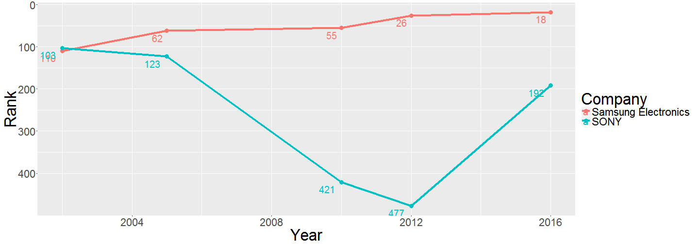

TRIZ Scope  - The Shiny Application
=====================
author: Nataly Rekuz
date: 12 Aug 2016
autosize: true


The Shiny Application "TRIZ Scope"
======================


I'd like to represent a shiny application ["TRIZ Scope"](https://natalyrekuz.shinyapps.io/TRIZ_Scope/)


The goal of app is to explore how the changing the scope of application of TRIZ is reflected in the content of the articles of site ["The TRIZ Journal"](https://triz-journal.com/).

## Brief Information about TRIZ

**TRIZ** (Russian: "teoriya resheniya izobretatelskikh zadach") is "a problem-solving, analysis and forecasting tool derived from the study of patterns of invention in the global patent literature". 

In English the name is typically rendered as "the theory of inventive problem solving".


Basic information about TRIZ can be found on Wikipedia:
<https://en.wikipedia.org/wiki/TRIZ>.


Famous Companies Use TRIZ methods
======================


**Rolls-Royce**             


**Daimler-Chrysler**        


**Johnson & Johnson**       


**Kodak**                   


**General Electric**


**IBM**


**LG**


**NASA**

etc.
***

**Boeing**                  


**Samsung Electronics**


**Hewlett Packard**         


**Intel**


**Motorola**                


**Procter and Gamble**


**Xerox**


**Ford**


Samsung Electronics - Famous Success Story
=======================

[Samsung Electronics has invested heavily in embedding TRIZ use throughout the company](http://www.forbes.com/sites/haydnshaughnessy/2013/03/07/why-is-samsung-such-an-innovative-company/2/#845820473983).


Using TRIZ technology allowed the company Samsung Electronics in 2004 to get more than 100 new patents, and in 2005 TRIZ methods have already been used successfully in more than 90 projects of the company, thus helping to increase intellectual property into key competitive areas of business.


The market capitalization of Samsung Electronics that was almost a quarter of the SONY capitalization at the end of the 1990s, and now it exceeds almost twice the price of a competitor.


This chunk of code creates the next page plot:


```r
library(ggplot2)
ggplot(Forbes_List, aes(x = Year, y = Number, color = Company)) +
    geom_line(lwd = 1.5) + geom_point(size = 4, shape=20) +
    ylab("Rank") +
    scale_y_reverse() +
    geom_text(aes(label = Number), hjust = -1.2, vjust = 1.6, nudge_y = 2)
```

Forbes List: Global 2000
========================

Changing companies' ranking in accordance with Forbes List "The World’s Biggest Public Companies".




Source: [www.Forbes.com](http://www.forbes.com/sites/timferguson/2012/04/30/samsung-v-sony-the-growing-2000-divide/#4fdfe63e4587)


**Study TRIZ and happy inventing!**
